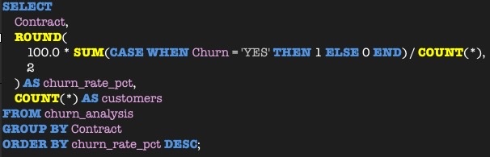
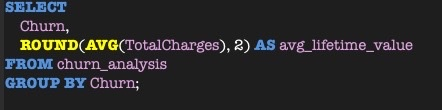
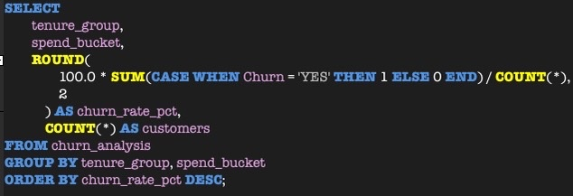
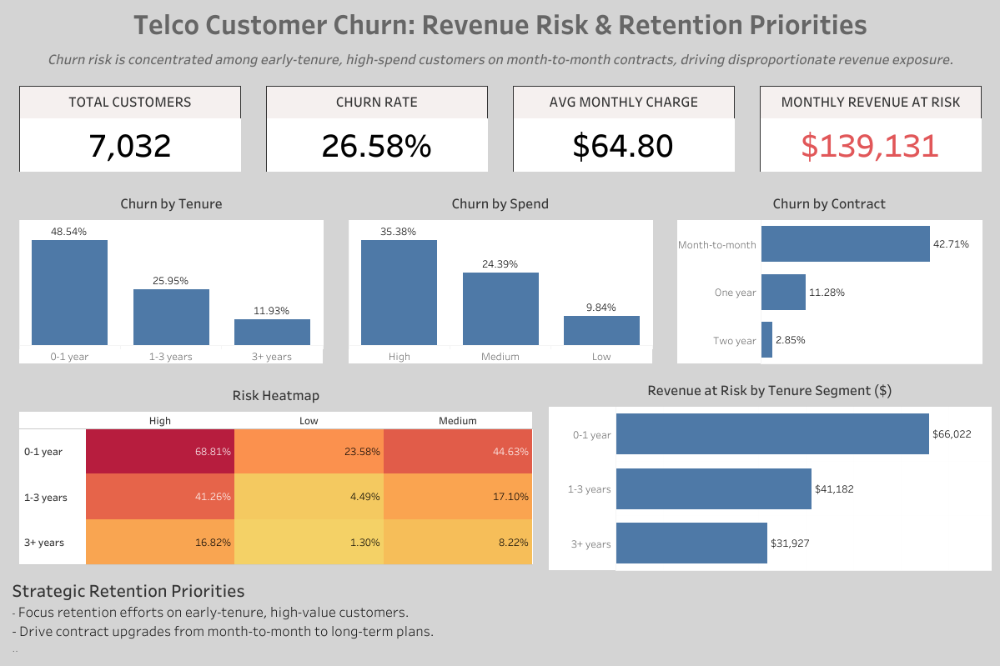

# TELCO CUSTOMER CHURN 
## Revenue Risk & Retention Strategy
Prepared by: Nothabo Moyo  
Dataset: 7,043 customers | 7,032 validated records (99.84% data integrity)    
Prepared for: VP Customer Success | Chief Revenue Officer | Head of Data | Senior Product Leaders  

## 1. Executive Summary 
$1.67M in annual revenue exposure is concentrated in early-tenure, high-spend, month-to-month customers. Churn is not random, it is identifiable and segment-driven.

### Headline Metrics 
- Total Customers: 7,032
- Overall Churn Rate: 26.58%
- Average Monthly Charge: $64.80
- Monthly Revenue Exposure: $139,131
- Annualized Exposure: $1.67M

### The "So What"
- 1 in 4 customers churn.
- High-value customers represent both the largest revenue base and the highest volatility risk.
- Revenue instability is primarily driven by first-year attrition.
- Contract structure is a primary behavioral driver of churn.

Without targeted intervention, revenue erosion will compound through high-value customer attrition.

## 2. Data Integrity & Governance 
Prior to analysis, a structured data quality framework was implemented to ensure analytical reliability and executive-level confidence:
- Primary key validation
- Duplicate detection (0 duplicates found)
- Categorical standardization
- Missing value remediation
- Business logic validation (excluded 11 tenure = 0 anomalies)
- Feature engineering (spend & life cycle segmentation)
- Production-ready view creation

Result: 7,032 clean records (99.84% retention), ensuring analytical reliability, reporting accuracy, and executive-grade decision support. 

## 3. Business-Relevant SQL Insights
Below are production-level queries that directly inform revenue strategy. 

### A. Contract-Driven Revenue Exposure 
  
Insight:
Month-to-month contracts exhibit significantly higher churn rates, positioning contract structure as a primary structural revenue risk. 

### B. Realized Lifetime Value Gap
  
Business Interpretation:
Churned customers realize materially lower lifetime value, indicating early lifecycle engagement failure and unrealized revenue potential.

### C. Churn Risk by Tenure & Spend Segment
  
Insight: 
- Churn risk concentrates in early-tenure, high-spend customers on month-to-month contracts.
- High-value customers with short tenure create disproportionate revenue volatility.
- Low-loyalty, high-revenue segments drive the majority of exposure.

## 4. Dashboard & Key Findings

  

  <em>Executive Churn Dashboard – Revenue Risk & Segment Exposure</em>

#### *The following abbreviations are explained for the insights below:*  
#### *X - Insight, Y - Drive, Z - Impact* 
### 1. Early Lifecycle Risk
X: Customers in their first year churn at 48.54%.  
Y: Onboarding friction and value realization gap.  
Z: Revenue loss concentrated in first 12 months.  
Recommendation: Implement a structured 30-60-90 day onboarding playbook with automated health scoring and proactive outreach. 

### 2. High-Spend Exposure
X: High-spend customers churn at 35.38%.  
Y: Premium customers lack perceived value differentiation.  
Z: Disproportionate revenue erosion from top-paying segment.  
Recommendation: Introduce loyalty tiers, bundled upgrades, and premium retention incentives. 

### 3. Contract Instability
X: Month-to-month contracts show 42.71% churn, compared to 11.28% (1-year) and 2.85% (2-years).  
Y: Low commitment structure enables easy switching behavior.  
Z: Revenue predictability and forecasting stability are compromised.  
Recommendation: Offer contract migration incentives (service add-ons over discounts).

### 4. The Highest-Risk Segment 
X: 0-1 Year + High Spend (68.81% churn) = Highest churn interaction  
Y: Premium customers fail to perceive early value  
Z: Largest controllable revenue lever  
Recommendation: Tag as "Critical Retention Cohort"  
Trigger: Day-30 executive outreach + proactive billing clarity + loyalty preview 

### 5. Revenue at Risk Is Front Loaded in Early Tenure
X: Customers in 0-1 year represent $66,022 in monthly revenue at risk, the largest tenure-based exposure.  
Y: Revenue vulnerability is concentrated at the beginning of customer lifecycle.  
Z: Reducing early churn has the highest marginal revenue impact.  
Recommendation: Shift retention budget toward early-lifecycle intervention. 

## 5. Strategic Retention Roadmap 
| Priority  | Segment | Action | Timeline |
|-----------|----------|---------|---------|
| URGENT | 0-1 Year + High Spend | Day-30 proactive outreach | Immediate |  
| HIGH | Month-to-month (ALL High Spend) | Contract upgrade incentives | This Quarter |
| MONITOR | 3+ Year Customers | Loyalty reinforcement & periodic health checks | Annual Review | 

## 6. Financial Framing for Executives 
Monthly revenue at risk: $139,131  
If churn is reduced by:  
- 5% absolute reduction > $83k annual revenue preserved. 
- 10% absolute reduction > $167k annual revenue preserved.
Retention ROI significantly outweighs acquisition cost.  

## 7. Conclusion 
Churn is not random. It is identifiable, segmentable, and financially quantifiable.  
The core structural risk lies in:  
- Early-tenure + High-spend + Month-to-month customers
Retention strategy must shift from reactive churn reporting to proactive revenue defense.

## 8. Connect With Me 
LinkedIn:www.linkedin.com/in/nothabo-michelle-moyo-a38840378  
Portfolio:https://github.com/Nothabo15  
Email: nothabomoyo07@gmail.com

## 9. Dashboard link 
[View Executive Dashboard (Tableau Public)](https://public.tableau.com/authoring/ChurnAnalysis_17707279524610/Dashboard1#1)

